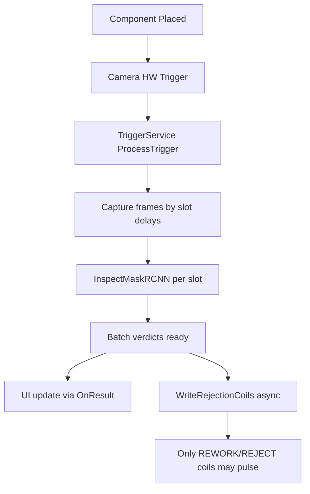
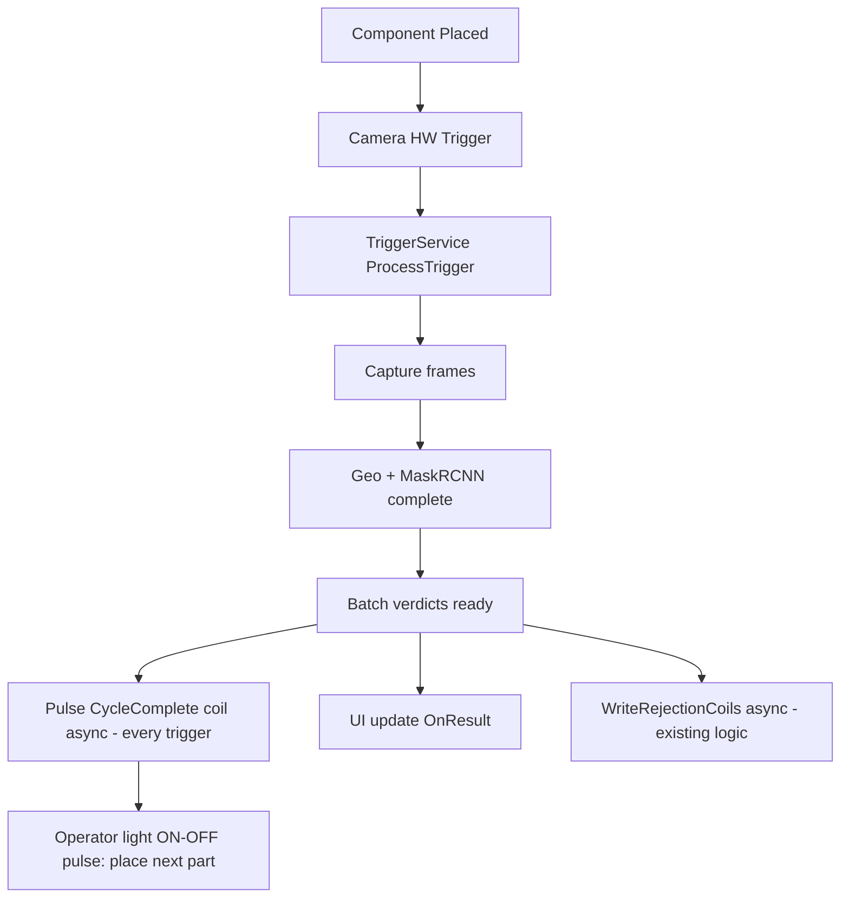

# Cycle-Complete Light Signal — Implementation Plan

## Goal
After each trigger cycle finishes inspection (geo + inference), pulse a dedicated PLC bit/coil so the operator knows the component is done and can place the next one.

This document describes:
- Flow design
- Exact files/line regions to update
- Logic to implement
- Before vs after behavior

---

## 1) Current Flow (Before)

### Current user-visible limitation
If verdict is PASS (or no reject/rework coil condition), there is no dedicated "cycle done" light pulse. Operator cannot reliably know when the full ~1s processing is complete.

---

## 2) Proposed Flow (After)

### Key behavior
- `CycleComplete` pulse runs on **every trigger batch**, independent of PASS/REWORK/REJECT.
- Existing reject/rework output logic remains unchanged.

---

## 3) Files and Line Regions to Change

> Line numbers are based on current branch snapshot and may shift slightly after edits.

## A) `RoboViz/Models/TriggerModels.cs`

### Region 1: `OutputCoilConfig` class (currently around lines 89–117)
Add new config properties:
- `CycleCompleteCoil` (`ushort`)
- `CycleCompleteDelayMs` (`int`, default `0`)
- `CycleCompleteOnDurationMs` (`int`, default `100–200`)

Optional variant (if separate lamps per group needed):
- `CycleCompleteCoil_G1`, `CycleCompleteCoil_G2`

### Region 2: optional config logging text (around lines 72–74)
Update load diagnostics to include cycle-complete settings.

---

## B) `RoboViz/Services/TriggerService.cs`

### Region 1: class fields (top of class, around lines 27–33)
Add Modbus write synchronization object:
- `private readonly object _modbusWriteLock = new();`

Reason: both rejection and cycle-complete writes are async and can overlap.

### Region 2: `ProcessTrigger(...)` (around lines 381–403)
After batch verdicts are finalized (and before/around current async rejection write scheduling), add scheduling for cycle-complete pulse.

Suggested placement point:
- After `_onResult(...)`
- Before/alongside `Task.Run(() => WriteRejectionCoils(...))`

### Region 3: helper methods near coil methods (around lines 494+)
Add:
- `PulseCycleCompleteCoil(int triggerGroup)`
- Reuse existing `ActivateCoil(...)` pattern (delay -> ON -> hold -> OFF)

### Region 4: `ActivateCoil(...)` (around lines 498–534)
Guard coil writes with `_modbusWriteLock` (or equivalent queue) to avoid concurrent serial-port usage.

---

## C) `RoboViz/Assets/trigger_config.json`

Add new keys under `OutputCoils`:
- `CycleCompleteCoil`
- `CycleCompleteDelayMs`
- `CycleCompleteOnDurationMs`

(If file is absent or keys missing, defaults from `OutputCoilConfig` apply.)

---

## 4) Logic to Implement

1. Trigger arrives and frame batch is processed as today.
2. Once `results[]` are ready (inspection cycle complete):
   - Publish UI result (existing)
   - Fire async cycle-complete pulse task (new)
   - Fire async reject/rework task (existing)
3. Cycle-complete pulse behavior:
   - Optional delay
   - Coil ON
   - Hold `CycleCompleteOnDurationMs`
   - Coil OFF
4. Error handling:
   - Log Modbus errors only; do not block consumer pipeline.

---

## 5) Before vs After — Behavior Difference

| Area | Before | After |
|---|---|---|
| End-of-cycle indication | Only implicit from UI / reject-rework coils | Explicit pulse every trigger |
| PASS batch signal | Usually no output coil action | Always gets cycle-complete pulse |
| Operator feedback | Inconsistent for next placement | Deterministic "done" light each cycle |
| Existing reject/rework path | Present | Unchanged |
| Throughput impact | None from this feature | Minimal (async pulse), no consumer blocking intended |

---

## 6) Timing Notes

- Your current total cycle includes capture + geo + inference, and can be ~1s or more.
- The cycle-complete pulse must be emitted only after verdict computation is complete.
- Pulse duration recommendation: `100–200 ms` for reliable PLC/light detection.

---

## 7) Validation Checklist

1. Trigger one component with PASS result -> cycle-complete lamp pulses.
2. Trigger REWORK/REJECT case -> cycle-complete lamp pulses + existing reject/rework coil behavior still works.
3. Back-to-back triggers -> no serial collision errors in logs.
4. If Modbus disconnected -> processing continues, error logged, no crash.

---

## 8) Summary

This change introduces a dedicated, per-trigger "inspection completed" output pulse without altering the existing decision logic. It improves operator usability by clearly signaling when the system has finished processing and is ready for the next component.
