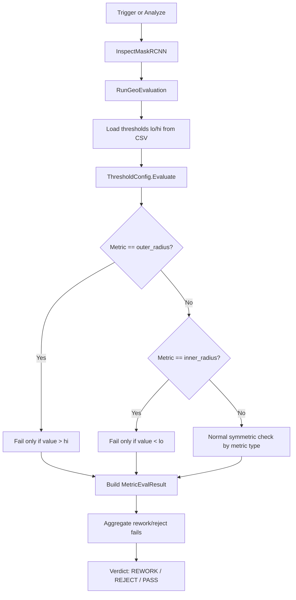
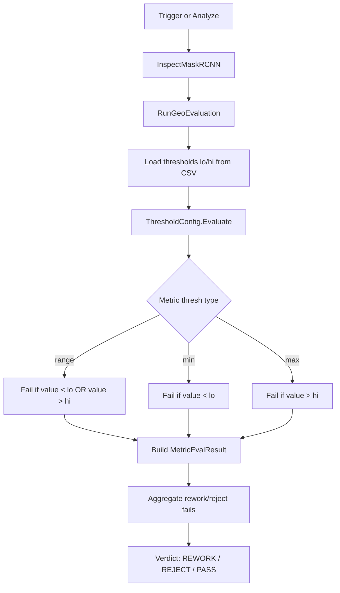

# Solution for Assymeteric Check

## Present Situation

The current geometric threshold pipeline for radius metrics is **asymmetric**.

Thresholds are loaded from the CSV stats files using:
- `p5` -> lower bound (`lo`)
- `p95` -> upper bound (`hi`)

However, in `ThresholdConfig.Evaluate(...)`, the two radius metrics are checked with one-sided rules:

- `outer_radius` fails only when `value > hi`
- `inner_radius` fails only when `value < lo`

So even though both lower and upper threshold values are shown in the UI and are loaded from the CSV, the code does **not** enforce both sides for these two metrics.

### What this means in practice

If the intended tolerance is `low <= value <= high`, then the present code can still mark some out-of-range values as `PASS`:

- `outer_radius < lo` -> currently still passes
- `inner_radius > hi` -> currently still passes

This becomes more visible now because the CAM 2 geometric measurement is based on the YOLO bbox-derived radius estimate and the threshold CSVs are being manually tuned with explicit `p5` / `p95` values.

---

## Present Flow

---

## Why This Can Be Problematic

The current logic is only correct if the intended business rule is:

- outer radius should not become too large
- inner radius should not become too small

If the actual intention is:

- outer radius must stay within a calibrated band
- inner radius must stay within a calibrated band

then the current implementation is incomplete.

This creates a mismatch between:
- what the CSV threshold values appear to represent,
- what the UI shows,
- and what the runtime actually enforces.

---

## Suggested New Solution

The suggested solution is to make `outer_radius` and `inner_radius` use **normal symmetric range checking**, just like a true ranged metric.

That means:

- `outer_radius` fails if `value < lo` **or** `value > hi`
- `inner_radius` fails if `value < lo` **or** `value > hi`

This aligns runtime behavior with the manually tuned `p5` / `p95` values.

### Suggested rule change

Instead of this special-case logic:

- `outer_radius`: only check upper side
- `inner_radius`: only check lower side

use this behavior:

- both use full range check

---

## Suggested New Flow

---

## Why This Solution Is Recommended

This is recommended because it makes the system easier to understand and maintain:

1. **CSV meaning becomes intuitive**
   - `p5` = lower accepted limit
   - `p95` = upper accepted limit

2. **UI and runtime logic match**
   - displayed low/high thresholds will reflect the actual pass/fail rules

3. **Manual calibration becomes reliable**
   - when calibrated averages are converted to `±1%`, both sides of the tolerance band are really enforced

4. **Less confusion during debugging**
   - an operator or developer will not see a value outside the shown range and still get `PASS`

---

## Example of the Intended Behavior

If the calibrated range for `outer_radius` is:
- `lo = 602.4942`
- `hi = 614.6658`

then:
- `610` -> PASS
- `620` -> FAIL
- `590` -> FAIL

If the calibrated range for `inner_radius` is:
- `lo = 322.6410`
- `hi = 329.1590`

then:
- `326` -> PASS
- `320` -> FAIL
- `340` -> FAIL

This is the expected behavior when a true `±1%` threshold band is defined.

---

## Implementation Suggestion

When this change is implemented later, the update should be made in:
- `RoboViz\Services\ThresholdConfig.cs`

The special-case handling for `outer_radius` and `inner_radius` inside `Evaluate(...)` should be removed or changed so they follow standard `range` behavior.

---

## Current Decision

As requested, the present code is being left unchanged for now.

This document records:
- the present asymmetric behavior,
- why it may be undesirable,
- and the recommended symmetric-range solution for future implementation.
