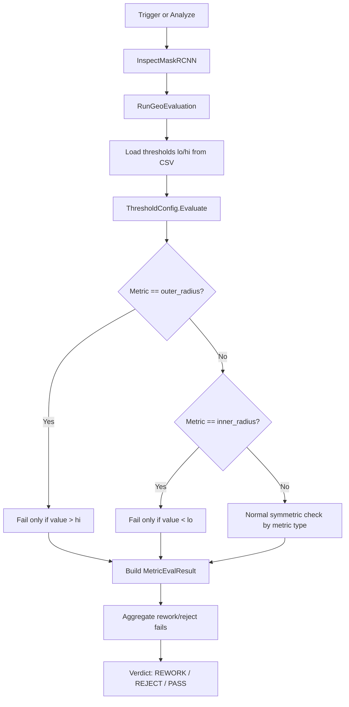
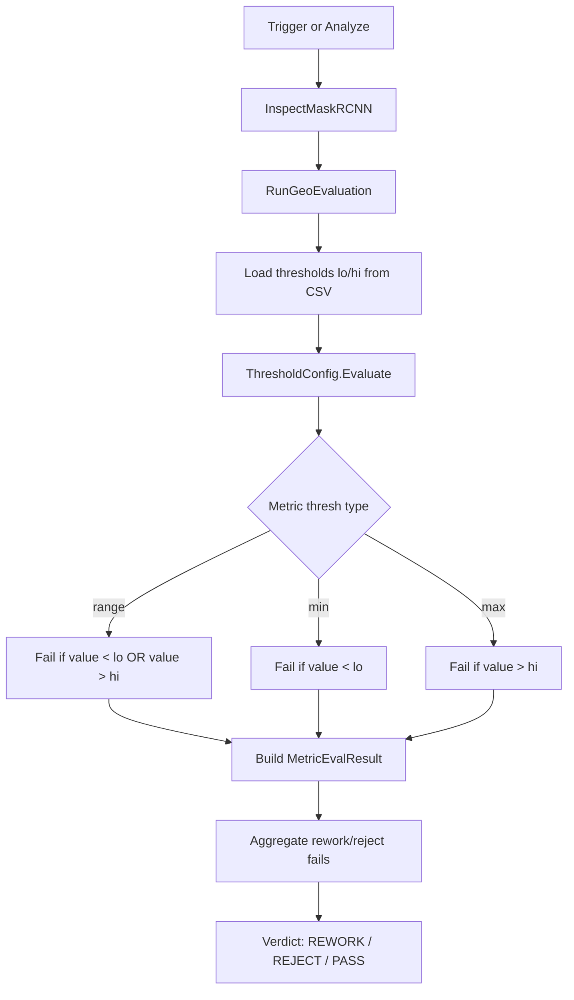
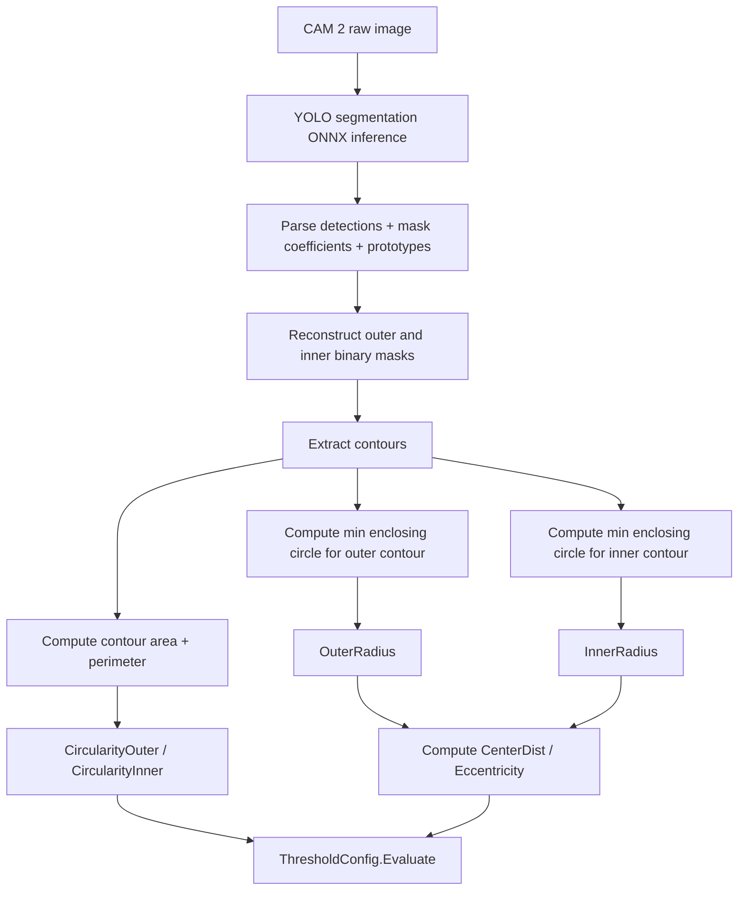

# Solution for Assymeteric Check

## Present Situation

The current geometric threshold pipeline for radius metrics is **asymmetric**.

Thresholds are loaded from the CSV stats files using:
- `p5` -> lower bound (`lo`)
- `p95` -> upper bound (`hi`)

However, in `ThresholdConfig.Evaluate(...)`, the two radius metrics are checked with one-sided rules:

- `outer_radius` fails only when `value > hi`
- `inner_radius` fails only when `value < lo`

So even though both lower and upper threshold values are shown in the UI and are loaded from the CSV, the code does **not** enforce both sides for these two metrics.

### What this means in practice

If the intended tolerance is `low <= value <= high`, then the present code can still mark some out-of-range values as `PASS`:

- `outer_radius < lo` -> currently still passes
- `inner_radius > hi` -> currently still passes

This becomes more visible now because the CAM 2 geometric measurement is based on the YOLO bbox-derived radius estimate and the threshold CSVs are being manually tuned with explicit `p5` / `p95` values.

---

## Present Flow



---

## Why This Can Be Problematic

The current logic is only correct if the intended business rule is:

- outer radius should not become too large
- inner radius should not become too small

If the actual intention is:

- outer radius must stay within a calibrated band
- inner radius must stay within a calibrated band

then the current implementation is incomplete.

This creates a mismatch between:
- what the CSV threshold values appear to represent,
- what the UI shows,
- and what the runtime actually enforces.

---

## Suggested New Solution

The suggested solution is to make `outer_radius` and `inner_radius` use **normal symmetric range checking**, just like a true ranged metric.

That means:

- `outer_radius` fails if `value < lo` **or** `value > hi`
- `inner_radius` fails if `value < lo` **or** `value > hi`

This aligns runtime behavior with the manually tuned `p5` / `p95` values.

### Suggested rule change

Instead of this special-case logic:

- `outer_radius`: only check upper side
- `inner_radius`: only check lower side

use this behavior:

- both use full range check

---

## Suggested New Flow



---

## Why This Solution Is Recommended

This is recommended because it makes the system easier to understand and maintain:

1. **CSV meaning becomes intuitive**
   - `p5` = lower accepted limit
   - `p95` = upper accepted limit

2. **UI and runtime logic match**
   - displayed low/high thresholds will reflect the actual pass/fail rules

3. **Manual calibration becomes reliable**
   - when calibrated averages are converted to `±1%`, both sides of the tolerance band are really enforced

4. **Less confusion during debugging**
   - an operator or developer will not see a value outside the shown range and still get `PASS`

---

## Example of the Intended Behavior

If the calibrated range for `outer_radius` is:
- `lo = 602.4942`
- `hi = 614.6658`

then:
- `610` -> PASS
- `620` -> FAIL
- `590` -> FAIL

If the calibrated range for `inner_radius` is:
- `lo = 322.6410`
- `hi = 329.1590`

then:
- `326` -> PASS
- `320` -> FAIL
- `340` -> FAIL

This is the expected behavior when a true `±1%` threshold band is defined.

---

## Implementation Suggestion

When this change is implemented later, the update should be made in:
- `RoboViz\Services\ThresholdConfig.cs`

The special-case handling for `outer_radius` and `inner_radius` inside `Evaluate(...)` should be removed or changed so they follow standard `range` behavior.

---

## Current Decision

As requested, the present code is being left unchanged for now.

This document records:
- the present asymmetric behavior,
- why it may be undesirable,
- and the recommended symmetric-range solution for future implementation.

---

## Additional Decision: CAM 2 Measurement Stability Improvement

Separate from the asymmetric-threshold issue above, CAM 2 currently has another practical limitation:

- it uses YOLO detections,
- but only consumes the axis-aligned bounding boxes,
- and estimates radius using `(width + height) / 4`.

This works for many parts, but it can become unstable when the same defective part appears at a different rotation or orientation.
In that situation, the physical part is the same, but the axis-aligned bounding box changes, which changes the estimated radius and can flip the verdict between `PASS` and `REWORK`.

### Present CAM 2 measurement flow

```mermaid
flowchart TD
    A[CAM 2 raw image] --> B[YOLO segmentation ONNX inference]
    B --> C[Parse detections]
    C --> D[Ignore mask output]
    D --> E[Take 2 largest axis-aligned boxes]
    E --> F[OuterRadius = (outer_w + outer_h) / 4]
    E --> G[InnerRadius = (inner_w + inner_h) / 4]
    F --> H[Compute CenterDist / Eccentricity]
    G --> H
    H --> I[ThresholdConfig.Evaluate]
```

### Why this is insufficient

The axis-aligned bbox method is orientation-sensitive:

1. the same part can rotate,
2. the protrusion or extra material can appear on another side,
3. the upright bounding box changes,
4. the estimated radius changes,
5. the verdict can flip even though the defect is the same.

This issue has been observed especially for some `Model 1 -> CAM 2 -> REWORK` samples.

---

## Chosen Direction for CAM 2

The selected improvement direction is:

- use the **YOLO segmentation mask itself**,
- reconstruct the outer and inner instance masks,
- extract contours from those masks,
- compute geometry from the actual shape,
- use **minimum enclosing circle** and **circularity** instead of plain bbox-only radius.

### New proposed CAM 2 measurement flow



### Why this direction is chosen

This direction is preferred over bbox-only radius because:

1. it uses the actual predicted shape rather than only the box around it,
2. it is less sensitive to rotation,
3. it gives meaningful `CircularityOuter` and `CircularityInner` again,
4. it better matches the physical geometry of a washer,
5. it should reduce the `same part -> different orientation -> different verdict` problem.

---

## Files Planned for This Change

### 1. `RoboViz/Services/YoloContourDetector.cs`

Planned changes:

- stop ignoring the mask branch of the YOLO segmentation output,
- reconstruct instance masks from:
  - detection mask coefficients,
  - prototype masks,
- expose enough information for CAM 2 geometry:
  - outer mask / contour,
  - inner mask / contour,
  - detection confidence / class if needed.

### 2. `RoboViz/Services/OringMeasurement.cs`

Planned changes:

- replace the current bbox-based `MeasureCam2(...)` implementation,
- use reconstructed masks and contours,
- compute:
  - `OuterRadius` from the outer contour's minimum enclosing circle,
  - `InnerRadius` from the inner contour's minimum enclosing circle,
  - `CenterDist` from the circle centers,
  - `EccentricityPct` from the same existing formula,
  - `CircularityOuter` from contour area / perimeter,
  - `CircularityInner` from contour area / perimeter.

### 3. `RoboViz/Models/GeometricResult.cs`

Likely unchanged unless extra overlay/debug data is required.
If necessary, this file may be extended to store additional contour or circle metadata for CAM 2 visualization.

### 4. `RoboViz/Services/InspectionService.cs`

Expected to remain functionally unchanged.
It will continue calling `MeasureCam2(...)`; only the internal measurement method will change.

---

## Parts That Will Remain Unchanged

The following parts are not intended to change as part of this CAM 2 measurement improvement:

- `ThresholdConfig.Evaluate(...)` asymmetric logic (for now),
- trigger threading model,
- `TriggerService`,
- `Analyze` vs trigger orchestration,
- output coil logic,
- CAM 3 / CAM 4 resize-only path,
- CSV threshold loading flow.

---

## Timing Expectation

This change adds:

- mask reconstruction,
- contour extraction,
- enclosing-circle calculation,
- circularity calculation.

But these are still small compared to:

- the camera trigger-to-frame delay,
- the main MaskRCNN inference time.

So the expected total cycle time should remain in roughly the same class, with only a modest CPU increase.

---

## Implementation Start Note

The implementation will begin with:

1. extending `YoloContourDetector.cs` to reconstruct usable masks,
2. updating `OringMeasurement.MeasureCam2(...)` to use contour-based geometry,
3. validating the rotated / flipped Model 1 rework case,
4. then retuning `model1_3002_measurements_stats.csv` and `model2_3002_measurements_stats.csv` if needed.
